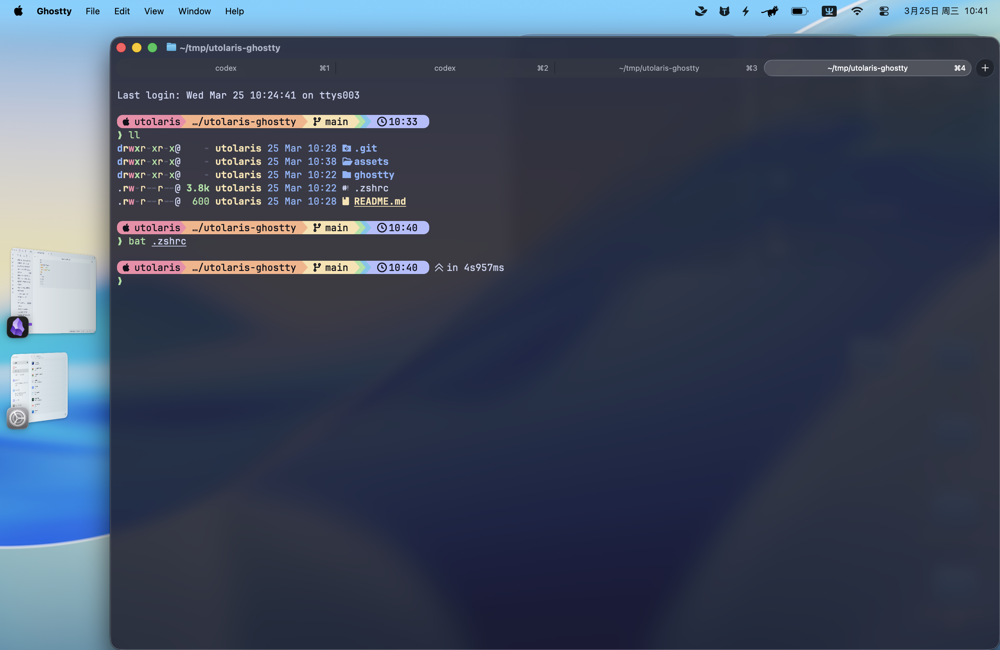

# utolaris-ghostty

## 桌面效果

## 配置内容

- `.zshrc`：Zsh 的 shell 配置，包含 prompt、插件、别名和常用工具默认设置。原始文件中的敏感 `env` 段已排除。
- `ghostty/config`：Ghostty 终端配置，主要包括字体、主题、透明度、窗口行为和输入体验。

## 使用教程

1. 前提条件：你的系统需要是 macOS，已经安装 Homebrew，并且终端默认 shell 是 Zsh 而不是 Bash。
2. 从 Ghostty 官网下载安装包：<https://ghostty.org/download>
3. 将这个项目链接发给 Codex 或 Claude Code，让它帮你把配置落到本机环境里。
4. 按照仓库里的 `.zshrc` 和 `ghostty/config` 进行同步，必要时先备份你自己的原配置。

## 视觉效果

- 整体是偏克制的深色终端风格，背景半透明、边缘柔和，桌面感比较强。
- Starship prompt 会把路径、分支和状态信息压缩成更易扫读的提示行。
- 语法高亮和自动补全会让输入过程更清楚，终端看起来也更整洁。

## 加载的插件和集成

- Starship prompt（美化提示符，并显示路径、分支和状态信息）
- zsh-syntax-highlighting（输入时高亮命令，减少拼写错误）
- zsh-autosuggestions（根据历史命令自动补全建议）
- zsh-completions（补充更多命令补全能力，配合 `fpath` 和 `compinit` 使用）
- `fzf` shell 集成（模糊搜索历史命令和文件路径）
- `zoxide`（更快跳转常用目录）
- `fnm`（管理 Node.js 版本并按目录自动切换）

## 优势

- 更快定位当前路径、Git 分支和命令状态。
- 更少的手动输入，常用路径和历史命令更容易复用。
- 终端显示更统一，适合长时间使用。
- 既保留效率，也保留一定的视觉层次感。
- Ghostty 的性能和 GPU 加速让终端滚动、渲染和日常交互更顺滑，相比系统自带终端更适合作为主力终端。
- Anthropic 官方文档强调 Claude Code 需要一个配置良好的终端环境；Ghostty 这类终端更适合这类工作流。

这个快照不包含密钥或私钥。
